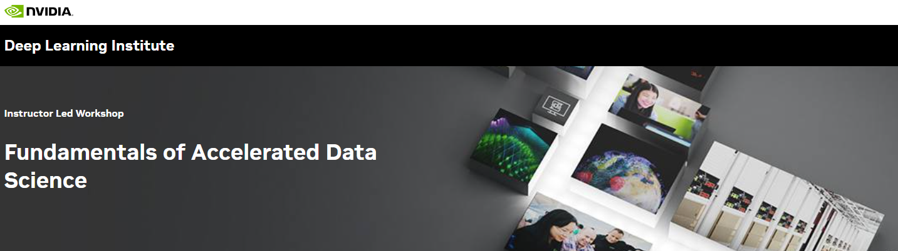

## Table of Contents
1. [Description](#description)
2. [Information](#information)
3. [Certificate](#certificate)

## Description

Data science is about using scientific methods, processes, algorithms, and systems to analyze and extract insights from data. It empowers organizations to turn data into a valuable resource, leading to smarter decision-making, improved operations, and enhanced customer experiences. In this workshop, you will learn how to use GPU-accelerated tools to conduct data science faster, leading to more scalable, reliable, and cost-effective results.

## Information
Upon completion, you will be able to perform various data science tasks more efficiently, enabling more iteration cycles and drastically improving productivity:

> - Use cuDF to accelerate pandas, Polars, and Dask for analyzing datasets of all sizes efficiently.
> - Utilize a wide variety of machine learning algorithms, including XGBoost, for different data science problems.
> - Deploy machine learning models on a Triton Inference Server to deliver optimal performance.
> - Learn and apply powerful graph algorithms to analyze complex networks with NetworkX and cuGraph.
> - Perform multiple analysis tasks on massive datasets to stave off a simulated epidemic outbreak effecting the UK.

More detailed information and links for the course can be found on the [course website](https://learn.nvidia.com/courses/course?course_id=course-v1:DLI+C-DS-02+V2&unit=block-v1:DLI+C-DS-02+V2+type@vertical+block@ab89a641ed8f4e69933874b1d09e5368).

## Certificate

The certificate for the course can be found below:

- ["Fundamentals of Accelerated Data Science" - NVIDIA Deep Learning Institute]() (Issued On: March 2025)
